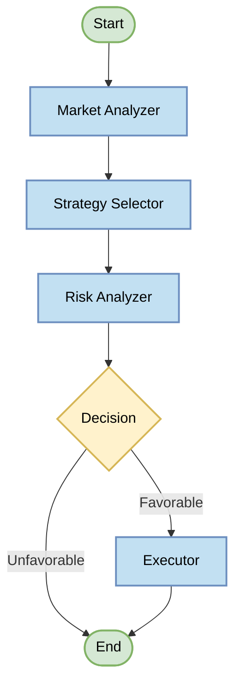

# BiBot AI - Agentic Trading Bot for Binance Futures

An intelligent trading bot for Binance Futures that uses LangGraph and Large Language Models to analyze markets, select strategies, assess risks, and execute trades autonomously. BiBot-AI follows an agentic workflow to make trading decisions with minimal human intervention.

## Features

- **AI-Powered Decision Making**: Uses Large Language Models to analyze markets and make trading decisions
- **Agentic Workflow Architecture**: Structured LangGraph-based workflow with specialized nodes for different aspects of trading
- **Autonomous Trading**: Continuously monitors markets and executes trades without human intervention
- **Customizable Strategies**: Supports multiple trading strategies with dynamic selection based on market conditions
- **Risk Management**: Built-in risk assessment before executing trades
- **Position Tracking**: Maintains state of current positions across sessions
- **Stop-Loss & Take-Profit**: Automatic order management for risk control
- **Testnet Support**: Safe testing on Binance Futures Testnet before trading with real funds

## Architecture

BiBot-AI uses a LangGraph-powered workflow with specialized nodes:

```
Market Analysis → Strategy Selection → Risk Assessment → Execution
```



Each node enriches the trading state with additional information and insights:

- **Market Analyzer**: Evaluates current market conditions using technical indicators and price data
- **Strategy Selector**: Selects the optimal trading strategy based on market analysis
- **Risk Analyzer**: Assesses potential risks and determines if conditions are favorable
- **Executor**: Executes trades when conditions are favorable

For a more detailed architecture overview, see the [architecture documentation](docs/architecture.md) and [technical documentation](docs/technical_architecture.md).

## Local Setup with Poetry

### Prerequisites
- Ensure you have Python 3.9 or higher installed on your machine.
- Install Poetry for dependency management. You can follow the instructions on [Poetry's official website](https://python-poetry.org/docs/#installation).

### Clone the Repository
First, clone the repository to your local machine:

```bash
git clone https://github.com/ezalabs/bibot-ai.git
cd bibot-ai
```

### Install Dependencies
Use Poetry to install the project dependencies:

```bash
poetry install
```

### Running the Bot
To run the bot locally, you can use the following command:

```bash
poetry run python -m app.main
```

To run with a custom trading interval (in seconds):

```bash
poetry run python -m app.main --interval 300  # Run every 5 minutes
```

To clean up all tracked positions and exit:

```bash
poetry run python -m app.main --cleanup
```

## Docker Setup

### Prerequisites
- Ensure you have Docker installed on your machine. You can download it from [Docker's official website](https://www.docker.com/get-started).

### Building the Docker Image
To build the Docker image for BiBot-AI, navigate to the project directory and run the following command:

```bash
docker build -t bibot-ai .
```

### Running with Docker Compose
The easiest way to run BiBot-AI with Docker is using Docker Compose:

```bash
docker-compose up -d
```

This will start BiBot-AI in detached mode, with proper volume mapping for logs and cache.

### Running the Docker Container Manually
To run the Docker container manually, use the following command, ensuring to pass your environment variables from the `.env` file:

```bash
docker run -v $(pwd)/cache:/app/cache -v $(pwd)/logs:/app/logs --env-file .env bibot-ai
```

Note: The volume mounts ensure that both cache and logs are preserved between container restarts.

## Cache System

BiBot-AI includes a state persistence system that saves active positions to a local cache file. This ensures that:

1. If the bot is restarted, it will reload any open positions and continue managing them
2. No positions are orphaned if the bot crashes or is shut down
3. All stop-loss and take-profit orders are properly tracked and managed

The cache files are stored in a `cache` directory in the project root, with filenames based on the trading pair being used.

## Environment Variables

BiBot-AI is configured through environment variables or a `.env` file. Here are the available configuration options:

```
# API Credentials
BINANCE_API_KEY=your_api_key
BINANCE_API_SECRET=your_api_secret
OPENAI_API_KEY=your_openai_api_key

# Runtime Settings
BINANCE_TESTNET=true  # Use 'true' for testnet, 'false' for real trading
TRADING_SYMBOL=BTCUSDT
TRADING_LEVERAGE=5
MAX_POSITIONS=3

# LLM Configuration
MODEL_NAME=gpt-4o-mini  # LLM model to use for trading decisions
MODEL_TEMPERATURE=0.1   # Lower values for more deterministic outputs

# Strategy Parameters
RSI_PERIOD=14
RSI_OVERBOUGHT=70
RSI_OVERSOLD=30
EMA_FAST_PERIOD=12
EMA_SLOW_PERIOD=26
TAKE_PROFIT_PERCENTAGE=0.1
STOP_LOSS_PERCENTAGE=0.05

# Logging
LOG_LEVEL=INFO  # Options: DEBUG, INFO, WARNING, ERROR, CRITICAL

# Strategy
STRATEGY=RSI_EMA  # Default strategy to use
```

## Logs

Logs are stored in the `logs` directory with timestamps for each session. You can monitor the bot's activity in real-time:

```bash
tail -f logs/bibot_session_<timestamp>.log
```

## Implementing Custom Trading Strategies

BiBot-AI is designed with an extensible architecture that allows you to easily implement custom trading strategies. The bot uses a strategy factory pattern along with type-safe Pydantic models for configuration.

### Strategy Architecture

The strategy system consists of three main components:

1. The `TradingStrategy` abstract base class defining the interface
2. A `StrategyFactory` responsible for creating and registering strategies
3. Individual strategy implementations (e.g., `RsiEmaStrategy`)

The core interface is defined in `app/strategies/strategy_base.py`:

```python
from abc import ABC, abstractmethod
from typing import List, Dict, Any

from app.models.strategy import TradingResult
from app.utils.binance.client import KlineData

class TradingStrategy(ABC):
    """Abstract base class for all trading strategies"""
    
    @abstractmethod
    def generate_trading_signals(self, klines: List[KlineData]) -> TradingResult:
        """
        Process historical data and generate trading signals.
        
        Args:
            klines: List of KlineData objects containing historical price/volume data
            
        Returns:
            A dictionary containing:
                - 'data': The processed data with indicators
                - 'signals': A dictionary with 'long' and 'short' boolean keys
        """
        pass
    
    def get_name(self) -> str:
        """Get the name of the strategy"""
        return self.__class__.__name__
```

### Creating a Custom Strategy

To implement your own strategy:

1. Create a new Python file in the `app/strategies/implementations` directory
2. Define a class that inherits from `TradingStrategy`
3. Implement the `generate_trading_signals` method
4. Register your strategy with the factory

Here's an example of a simple Moving Average Crossover strategy:

```python
from typing import List
import pandas as pd
from ta.trend import SMAIndicator

from app.strategies.strategy_base import TradingStrategy
from app.utils.binance.client import KlineData
from app.utils.data_converter import convert_klines_to_dataframe
from app.utils.logging.logger import get_logger

logger = get_logger(__name__)

class MaCrossStrategy(TradingStrategy):
    """Moving Average Crossover Strategy"""
    
    def __init__(self, config):
        """
        Initialize the MA Crossover strategy
        
        Args:
            config: Application configuration
        """
        self.config = config
        self.short_window = 10
        self.long_window = 50
        logger.info(f"Initializing {self.get_name()} with MA({self.short_window}/{self.long_window})")
    
    def generate_trading_signals(self, klines: List[KlineData]) -> dict:
        """
        Generate trading signals based on Moving Average crossovers
        
        Args:
            klines: List of KlineData objects containing historical price data
            
        Returns:
            Dictionary containing:
                - 'data': DataFrame with indicators
                - 'signals': Dictionary with 'long' and 'short' boolean keys
        """
        # Convert klines to DataFrame for technical analysis
        df = convert_klines_to_dataframe(klines)
        
        # Calculate moving averages
        df['short_ma'] = SMAIndicator(df['close'], window=self.short_window).sma_indicator()
        df['long_ma'] = SMAIndicator(df['close'], window=self.long_window).sma_indicator()
        
        # Generate signals
        df['long_signal'] = (df['short_ma'] > df['long_ma']) & (df['short_ma'].shift(1) <= df['long_ma'].shift(1))
        df['short_signal'] = (df['short_ma'] < df['long_ma']) & (df['short_ma'].shift(1) >= df['long_ma'].shift(1))
        
        # Get the latest signal
        latest_signal = {
            'long': bool(df['long_signal'].iloc[-1]),
            'short': bool(df['short_signal'].iloc[-1])
        }
        
        logger.debug(f"Latest MA Fast: {df['short_ma'].iloc[-1]:.2f}")
        logger.debug(f"Latest MA Slow: {df['long_ma'].iloc[-1]:.2f}")
        logger.debug(f"Trading signals: {latest_signal}")
        
        return {
            'data': df,
            'signals': latest_signal
        }
```

### Registering Your Strategy

Update the strategy factory to include your custom strategy:

```python
# In app/strategies/factory.py or __init__.py
StrategyFactory.register_strategy("MA_CROSS", MaCrossStrategy)
```

Then you can set the strategy in your `.env` file:

```
STRATEGY=MA_CROSS
```

## Safety Precautions

- **Always start with the testnet** (`BINANCE_TESTNET=true`)
- Begin with small position sizes
- Use the built-in stop-loss mechanisms
- Monitor the bot's activity using logs
- Regularly check your positions on the Binance interface
- Implement proper API key security (read-only for testing, limited IP access)

## Contributing

Contributions are welcome! Please feel free to submit a Pull Request.

## License

This project is licensed under the MIT License - see the LICENSE file for details.

## Disclaimer

Trading cryptocurrencies involves significant risk of loss and is not suitable for all investors. This bot is provided  for educational purposes only, as-is, without any guarantees. Always test thoroughly on the testnet before using with real funds. Past performance of trading strategies is not indicative of future results.
