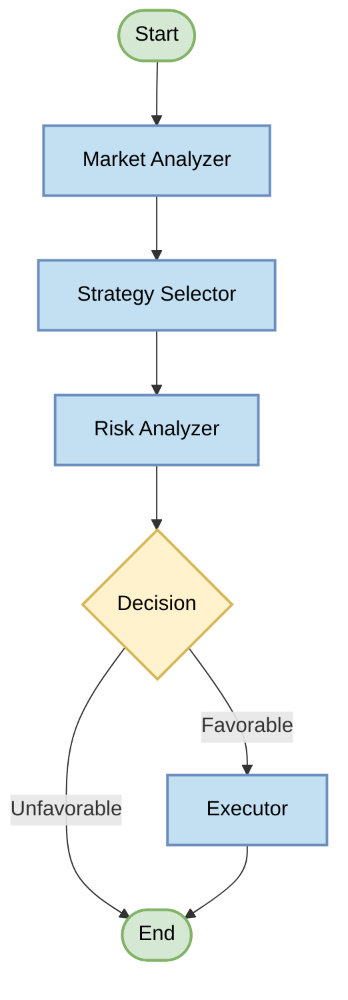

# BiBot Trading Agent Architecture

This document provides an overview of the BiBot trading agent architecture, which is built using LangGraph for orchestrating the decision-making flow.

## LangGraph Workflow

The trading agent uses a directed graph structure with specialized nodes for different aspects of the trading process.



## LangGraph Node Descriptions

### Market Analyzer
- Analyzes current market conditions using technical indicators and price data
- Examines market sentiment and volatility
- Produces a comprehensive market analysis report

### Strategy Selector
- Evaluates different trading strategies against current market conditions
- Selects the optimal strategy based on market analysis
- Configures strategy parameters (RSI periods, EMA lengths, etc.)

### Risk Analyzer
- Assesses potential risk factors for the selected strategy
- Evaluates position sizing and exposure
- Determines if trading conditions are favorable

### Executor
- Executes trades when conditions are favorable
- Manages order placement and position tracking
- Updates execution status in the state

## State Management

The workflow uses a unified `TradingState` Pydantic model that flows through the graph:

```python
class TradingState(BaseModel):
    # Input data
    market_data: Optional[Dict[str, Any]] = None
    
    # Analysis results
    market_analysis: Optional[Dict[str, Any]] = None
    selected_strategy: Optional[str] = None
    strategy_params: Optional[Dict[str, Any]] = None
    risk_assessment: Optional[Dict[str, Any]] = None
    
    # Trading signals and execution
    trading_signals: Optional[Dict[str, bool]] = None
    execution_status: Optional[Dict[str, Any]] = None
```

## Execution Flow

1. The agent initializes with a new `TradingState` instance
2. The state passes through each node in sequence:
   - Market Analyzer → Strategy Selector → Risk Analyzer → Executor
3. Each node enriches the state with additional information
4. The final state contains trading decisions and execution results
5. The agent runs in a continuous loop, executing this flow at regular intervals

## Configuration

The agent's behavior can be configured through environment variables or a config file, allowing customization of:
- Trading intervals
- Risk parameters
- Strategy selection criteria
- Position sizing rules 