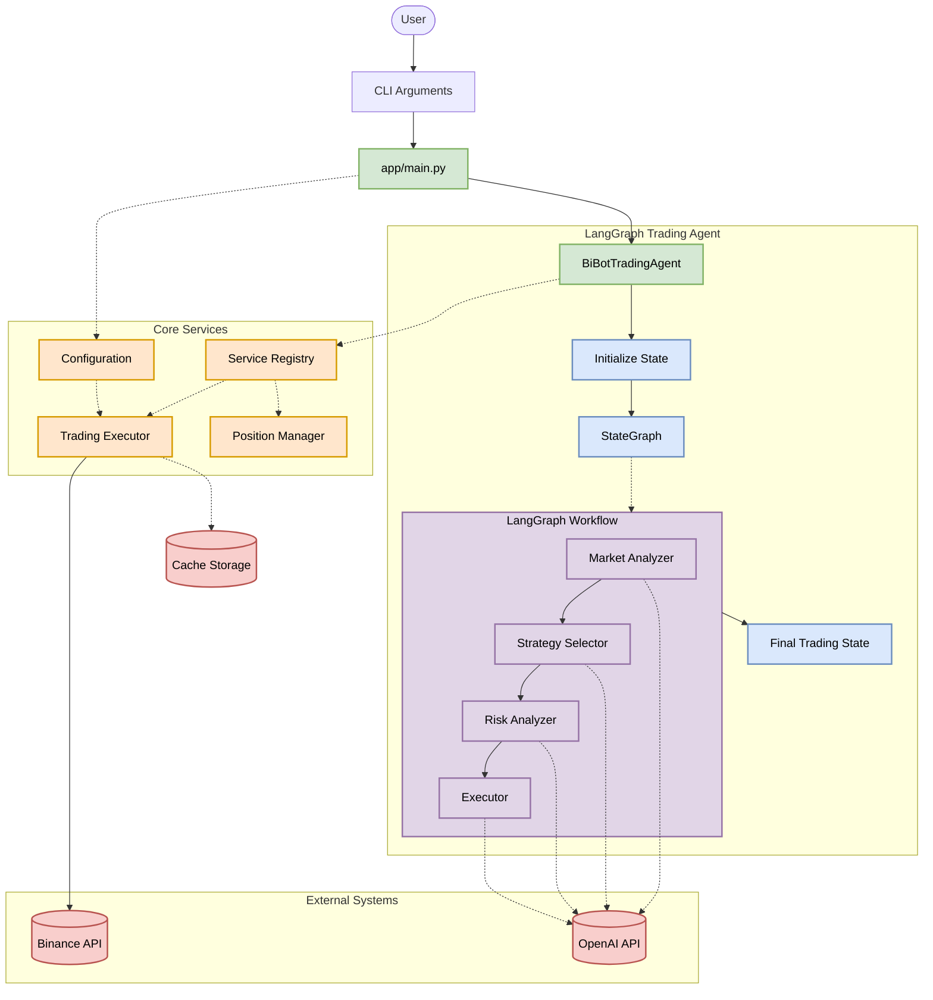

# BiBot Technical Architecture

This document provides a detailed technical overview of BiBot's architecture, showing how components interact and data flows through the system.

## System Architecture Diagram

## Component Details

### Main Entry Point (app/main.py)
- Handles CLI arguments for trading interval and cleanup options
- Manages the continuous execution loop
- Processes trading agent results
- Handles signal interruptions for graceful shutdown

### BiBot Trading Agent
- Core LangGraph-based agent implementing the trading workflow
- Manages state transitions between workflow nodes
- Orchestrates the decision-making process

### LangGraph StateGraph
- Directed graph structure defining the trading workflow
- Manages state transitions and node execution sequence
- Passes TradingState between nodes

### Workflow Nodes
Each node is implemented as a separate module:
- **Market Analyzer**: Processes market data and generates analysis
- **Strategy Selector**: Chooses and configures trading strategies
- **Risk Analyzer**: Performs risk assessment for trading decisions
- **Executor**: Executes trades based on signals and assessments

### Core Services
- **Service Registry**: Central registry for accessing shared services
- **Trading Executor**: Handles trade execution and order management
- **Position Manager**: Tracks and manages open positions
- **Configuration**: Manages app configuration from environment variables

### External Systems
- **Binance API**: Interface for trading on Binance Futures
- **OpenAI API**: LLM provider for decision-making components

## Data Flow

1. User starts the application with CLI arguments
2. Main entry point initializes the trading agent and services
3. Agent initializes a new TradingState
4. State passes through each node in sequence:
   - Market Analyzer analyzes current market conditions
   - Strategy Selector picks optimal strategy
   - Risk Analyzer assesses trading risks
   - Executor conditionally executes trades
5. Final state is returned to main entry point
6. Main processes results and sleeps until next trading cycle

## Configuration

Configuration flows from environment variables through:
1. `.env` file or environment variables
2. `BiBotConfig` Pydantic model
3. Component initialization parameters
4. Trading execution parameters

## Persistence

- Trading positions are cached between runs
- Logging is centralized to a `.logs` file at project root

## Deployment

The application can be deployed as:
- Standalone Python application
- Docker container (using provided Dockerfile)
- Docker Compose setup (using provided docker-compose.yml) 